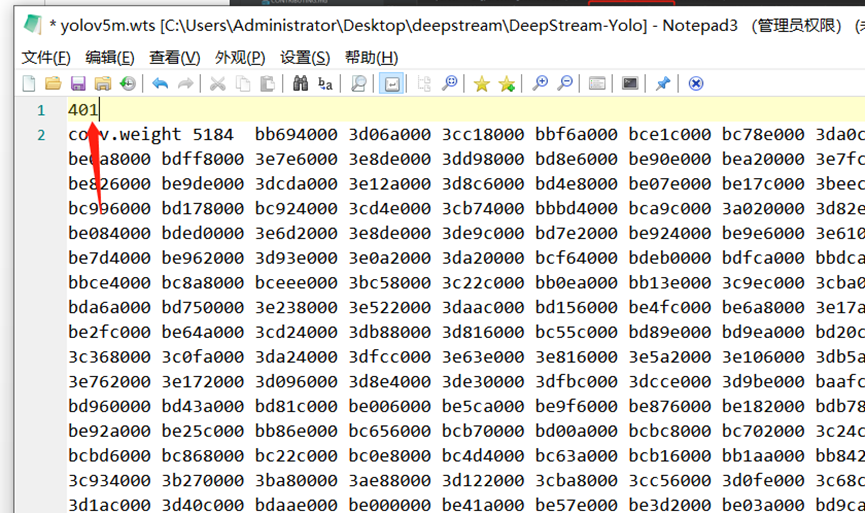

# YOLOv5 usage in deepstream6.2

#一.环境安装
##yolov5环境安装
参考官网:https://github.com/ultralytics/yolov5/tree/v6.0
##deepstream环境安装
参考官网:https://docs.nvidia.com/metropolis/deepstream/6.0.1/dev-guide/text/DS_Quickstart.html

#二.wts与cfg获得
##获得wts与cfg
将gen_wts_yoloV5.py复制到yolov5-6.0中，运行此文件，如下图所示：

##修改wts
通过查看wts有多少行，获得模型层，并在wts文件头行添加数字，如下图所示：

修改如下：

说明：n与s是291，m是401
#三.libnvdsinfer_custom_impl_Yolo.so库生成
在DeepStream-Yolo路径下执行以下命令：
```c
CUDA_VER=11.4 make -C nvdsinfer_custom_impl_Yolo
```
出现如下编译:

编译成功后会出现libnvdsinfer_custom_impl_Yolo.so，如下图：

#四.修改配置文件
主要修改文件路径，如下图所示：

#五.运行demo

```c
$cd  /opt/nvidia/deepstream/deepstream-6.2/sources/DeepStream-Yolo
$deepstream-app -c deepstream_app_config.txt
```
初次加载模型，需要构建engine转换，时间较长,加载完后会产生engine文件，不删除，下次运行无需编译可快速运行。
加载好模型会出现*.engine文件,如下所示：

运行成功会出现如下所示:


